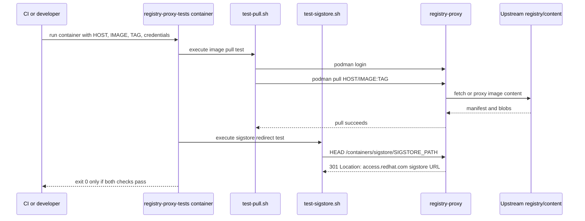

# registry-proxy-tests Architecture

This repository is intentionally small. It packages shell-based acceptance checks into a container image so registry-proxy changes can be tested the same way in local development, OpenShift jobs, and Konflux pipelines.

## Components

```text
Dockerfile                              Builds the test runner image
execute.sh                              Entrypoint that runs all checks
test-pull.sh                            Podman login and image pull validation
test-sigstore.sh                        Sigstore redirect validation
openshift/acceptance.yaml               OpenShift job definition
.tekton/*pull-request.yaml              PR pipeline
.tekton/*push.yaml                      Push pipeline
build-deploy.sh                         Build/deploy helper
pr-check.sh                             Local image build check
```

## Test Flow



## Inputs

- `HOST`: registry-proxy host, for example `registry-proxy.example.com`.
- `IMAGE`: repository path used for the pull test.
- `TAG`: image tag used for the pull test.
- `REGISTRY_USERNAME` and `REGISTRY_PASSWORD`: credentials for `podman login`.
- `SIGSTORE_PATH`: path segment expected under `/containers/sigstore/`.

OpenShift job defaults and parameter names are defined in `openshift/acceptance.yaml`. Keep the README, template parameters, and script variable names aligned.

## Failure Modes

- Missing Podman in the test image causes `test-pull.sh` to fail before login.
- Invalid credentials fail during `podman login` or `podman pull`.
- Incorrect `HOST`, `IMAGE`, or `TAG` fails image lookup.
- Incorrect sigstore routing fails when the response lacks a 301 or has a different `Location` header.
- Missing or malformed `SIGSTORE_PATH` makes the sigstore check build the wrong expected redirect URL.

## Pipeline Role

The tests are acceptance checks, not unit tests. They need a reachable registry-proxy deployment and test data that matches the environment. Keep assertions focused on externally observable behavior: login, pull, redirect status, and redirect target.

## Integration Points

- `registry-proxy`: target service under test.
- `.tekton/registry-proxy-tests-*.yaml`: Konflux image build definitions.
- `openshift/acceptance.yaml`: job template used to run the built image against a target registry-proxy deployment.
