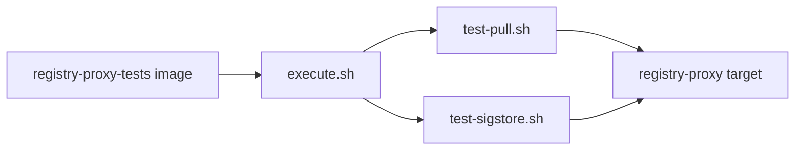

# Registry Proxy Tests

Test scripts to be used as acceptance criteria for registry proxy deployments

## Usage
Build and run the scripts locally using podman/docker:

```
docker build -t registry-proxy-tests .

docker run -e HOST={HOST} \
-e IMAGE={IMAGE} \
-e TAG={TAG} \
-e REGISTRY_USERNAME={REGISTRY_USERNAME} \
-e REGISTRY_PASSWORD={REGISTRY_PASSWORD} \
registry-proxy-tests
```

## Contextification Addendum



Required variables: `HOST`, `IMAGE`, `TAG`, `REGISTRY_USERNAME`, `REGISTRY_PASSWORD`, and `SIGSTORE_PATH`.

Use `./pr-check.sh` to build the local test image as `registry-proxy-test:pr-check`. Add new checks as scripts called by `execute.sh`. OpenShift job parameters live in `openshift/acceptance.yaml`.

Related repo: [registry-proxy](https://github.com/quay/registry-proxy).
